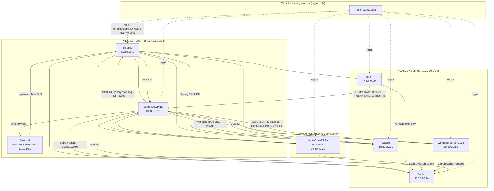
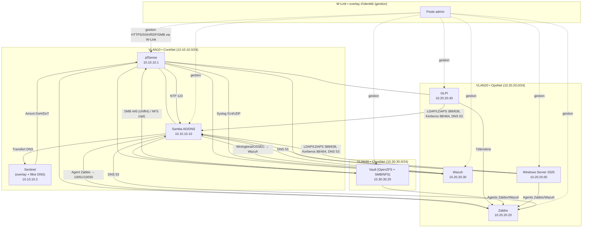

# 🥷🏽 Kasumura — Zero-Trust Lab Infrastructure


**Quick links / Liens rapides:** [🤝 Contributing](https://github.com/0x1void/OrcaZ/blob/main/Contributing.md) • [📜 Licence (MIT)](https://github.com/0x1void/OrcaZ/blob/main/Licence.md)

---

## 🇺🇸 🥷🏽

### 1) Overview 🚀

Kasumura is a small, real-world lab that runs on one hypervisor plus two lean Linux boxes. The network is split across three VLANs—CoreNet, OpsNet, ClientNet—so traffic stays tidy and easy to reason about. Identity comes first: Samba AD/DNS is the authority, hosts join the domain (Kerberos/LDAP), and all admin access flows through the private overlay **W-Link**. **Sentinel** provides the control plane (Headscale for the overlay, Pi-hole for DNS filtering) while **Vault** handles storage (OpenZFS + SMB/NFS) with snapshots and replication. The rest lives as VMs: pfSense for routing/firewall, Zabbix and Wazuh for observability, GLPI for ITSM, and Windows Server 2025 for exam tasks. Default-deny between VLANs, a simple **AD → Sentinel → DoH/DoT** DNS chain, and clean **10.x.x.x/24** addressing make the build reproducible, secure 🔒, and easy to operate 🧭.

* **Vault** — storage: **OpenZFS + Samba/NFS** (files, backups, snapshots).
* **Sentinel** — control: **Headscale** (identity overlay) + **Pi-hole** (DNS filter).
* **Virtualized** — **pfSense**, **Samba AD/DNS**, **Zabbix**, **Wazuh**, **GLPI**, **Windows Server 2025** (exam requirement).

> Remote administration is referenced only by the coded label **W-Link**.

**Stack (official docs)**
Arch Linux — [https://wiki.archlinux.org/](https://wiki.archlinux.org/)
KVM/QEMU — [https://www.qemu.org/](https://www.qemu.org/) · libvirt — [https://libvirt.org/](https://libvirt.org/)
Debian — [https://www.debian.org/releases/](https://www.debian.org/releases/)
OpenZFS — [https://openzfs.github.io/openzfs-docs/](https://openzfs.github.io/openzfs-docs/)
Samba AD/DC — [https://wiki.samba.org/index.php/Setting\_up\_Samba\_as\_an\_Active\_Directory\_Domain\_Controller](https://wiki.samba.org/index.php/Setting_up_Samba_as_an_Active_Directory_Domain_Controller)
Zabbix — [https://www.zabbix.com/documentation/current/en/manual/installation](https://www.zabbix.com/documentation/current/en/manual/installation)
Wazuh — [https://documentation.wazuh.com/current/](https://documentation.wazuh.com/current/)
GLPI — [https://glpi-project.org/](https://glpi-project.org/)
Pi-hole — [https://docs.pi-hole.net/](https://docs.pi-hole.net/)
Headscale — [https://headscale.net/](https://headscale.net/)
WireGuard — [https://www.wireguard.com/](https://www.wireguard.com/)
pfSense — [https://docs.netgate.com/pfsense/en/latest/](https://docs.netgate.com/pfsense/en/latest/)
Windows Server 2025 — [https://learn.microsoft.com/windows-server/](https://learn.microsoft.com/windows-server/)
Optional alt (Vault): TrueNAS CORE — [https://www.truenas.com/docs/core/](https://www.truenas.com/docs/core/)

---

### 2) Network & Addressing 🌐

Examples use **10.x.x.x/24** per VLAN for clarity. You can also use **172.16.0.0/12** or **192.168.0.0/16**, with CIDR sizes as needed (/27, /23, /22…).

| VLAN | Name      | Subnet/CIDR   | Gateway    | DHCP Pool                 | Key Static Hosts                                                                               |
| :--: | --------- | ------------- | ---------- | ------------------------- | ---------------------------------------------------------------------------------------------- |
|  10  | CoreNet   | 10.10.10.0/24 | 10.10.10.1 | 10.10.10.100–10.10.10.199 | **pfSense** 10.10.10.1 • **AD/DNS** 10.10.10.10 • **Sentinel** 10.10.10.2                      |
|  20  | OpsNet    | 10.20.20.0/24 | 10.20.20.1 | 10.20.20.100–10.20.20.199 | **Zabbix** 10.20.20.20 • **Wazuh** 10.20.20.30 • **GLPI** 10.20.20.40 • **WinSrv** 10.20.20.50 |
|  30  | ClientNet | 10.30.30.0/24 | 10.30.30.1 | 10.30.30.100–10.30.30.199 | **Vault** 10.30.30.20                                                                          |

**Domain/DNS:** `orcaz.lab` (AD/DNS 10.10.10.10).
**DNS path:** AD/DNS → Sentinel (filter) → upstream DoH/DoT.
**NTP:** pfSense ↔ pool.ntp.org; domain members via AD.

---

### 3) Blueprint 🧭



**ASCII fallback**

```text
W-Link (Admin) --> [ pfSense 10.10.10.1 ]
                      |-- [ AD/DNS 10.10.10.10 ]
                      |-- [ Zabbix 10.20.20.20 ]
                      |-- [ Wazuh 10.20.20.30 ]
                      |-- [ GLPI  10.20.20.40 ]
                      |-- [ WinSrv 10.20.20.50 ]
                      |-- [ Vault  10.30.30.20 ]
DNS: AD -> Sentinel -> upstream (DoH/DoT).  NTP: pfSense -> AD.
Logs: pfSense/syslog -> Wazuh. Agents: all -> Zabbix/Wazuh.
```

---

### 4) Roles, Placement & Sizing 🧱

| Component               | Platform                 | Placement | Minimum           | Notes                                                                |
| ----------------------- | ------------------------ | --------- | ----------------- | -------------------------------------------------------------------- |
| pfSense                 | VM                       | CoreNet   | 1 vCPU / 1–2 GB   | VLAN GW/DHCP; advertises routes to **W-Link**.                       |
| Samba AD/DNS            | VM                       | CoreNet   | 1 vCPU / 1–1.5 GB | Domain `orcaz.lab`; authoritative DNS; forwards to Sentinel.         |
| Zabbix                  | VM                       | OpsNet    | 1 vCPU / 1.5–2 GB | Agents everywhere; alerting.                                         |
| Wazuh (single node)     | VM                       | OpsNet    | 2 vCPU / 3–4 GB   | Keep indices small for lab.                                          |
| GLPI                    | VM                       | OpsNet    | 1 vCPU / 1–1.5 GB | ITSM; LDAP/Kerberos to AD.                                           |
| **Windows Server 2025** | VM                       | OpsNet    | 2 vCPU / 4–8 GB   | Exam tasks; domain member or lab AD tests; **mgmt only via W-Link**. |
| **Vault**               | **Bare-metal Linux**     | ClientNet | 8 GB RAM          | **OpenZFS + Samba/NFS**; set `zfs_arc_max≈2 GB`.                     |
| **Sentinel**            | **Bare-metal Linux/SBC** | Control   | —                 | **Headscale** (overlay) + **Pi-hole** (DNS filter).                  |

---

### 5) Zero‑Trust Rules 🛡️

* **Default inter‑VLAN:** deny all; allow only explicit flows.
* **W-Link overlay:** only authenticated admin reaches management (pfSense, AD, Zabbix, Wazuh, GLPI, WinSrv, Vault).
* **OpsNet → CoreNet:** allow DNS 53, LDAP/LDAPS 389/636, Kerberos 88/464, WinRM 5985/5986 (if used).
* **ClientNet → Vault:** allow SMB 445 (encryption required); allow AD join; block the rest.
* **Perimeter → Lab:** no routes.
* **DNS egress:** servers must use Sentinel; drop raw 53/853 to Internet.
* **Host firewalls:** local default‑deny; allow only from **W-Link** and designated VLANs.

---

### 6) Hardening 🔒

Minimal OS; timely patches; SSH keys only (`PermitRootLogin no`), MFA where supported.
pfSense: HTTPS admin; strong creds; config backups; pfBlockerNG optional.
AD/DNS: secure dynamic updates; password/lockout policy; time sync; delegated groups.
Vault: ZFS snapshots; **SMB encryption required**; least‑privilege shares; audit logs → Wazuh.
Sentinel: overlay bound to internal; Pi-hole DoH/DoT upstream; rotate pre‑auth keys.
All hosts: Zabbix + Wazuh agents; local firewall default‑deny; central logging.

---

### 7) Backups & Recovery 💾

* **3‑2‑1** rule (3 copies, 2 media, 1 offsite).
* **Configs:** pfSense XML, Samba AD state, GLPI/Zabbix/Wazuh DB dumps.
* **Data:** ZFS snapshots (hourly/daily/weekly) replicated off‑box.
* **Drills:** quarterly restore test (one VM + one dataset).

---

### 8) Build Steps 🧰

1. **Sentinel** (no GUI): Debian/Arch → **Headscale** (users, keys, ACL) + **Pi‑hole** (DoH/DoT).
2. **Vault**: Debian → **OpenZFS** (`tank`, `tank/shares`, `tank/backups`); **SMB 3.1.1 encryption**; optional NFS; set `zfs_arc_max≈2 GB`.
3. **Hypervisor**: **Arch Linux** + **KVM/QEMU/libvirt**; one bridge per VLAN; cloud‑init images.
4. **pfSense**: VLAN 10/20/30; gateways `10.10.10.1 / 10.20.20.1 / 10.30.30.1`; DHCP; **W‑Link** client; advertise routes.
5. **Samba AD/DC**: domain `orcaz.lab` at `10.10.10.10`; DNS authoritative; forward to Sentinel.
6. **Ops VMs**: **Zabbix**, **Wazuh**, **GLPI**, **WinSrv** on VLAN20; auth to AD/DNS.
7. **Firewall rules**: apply the Zero‑Trust matrix.
8. **Validation**: run the checklist.

---

### 9) Validation Checklist ✅

- [ ] **Overlay reachability** — From **W-Link**, open each admin UI:  
  `https://10.10.10.1` (pfSense), `https://10.20.20.20` (Zabbix),  
  `https://10.20.20.30` (Wazuh), `https://10.20.20.40` (GLPI),  
  `https://10.20.20.50` (Windows), `smb://10.30.30.20` (Vault).
- [ ] **DNS authority** —  
  `dig @10.10.10.10 glpi.orcaz.lab +short` → **10.20.20.40** ;  
  `dig @10.10.10.10 zabbix.orcaz.lab +short` → **10.20.20.20** ;  
  `dig @10.10.10.10 winsrv.orcaz.lab +short` → **10.20.20.50**.
- [ ] **Pi-hole path** — On a server, `nslookup doubleclick.net 10.10.10.10` returns **blocked/0.0.0.0**; AD/DNS forwards to **Sentinel** only.
- [ ] **AD/Kerberos health** —  
  `kinit administrator@ORCAZ.LAB` → ticket OK ; `klist` shows valid TGT ; `wbinfo -t` (trust) **succeeds**.
- [ ] **Time sync** — `timedatectl` on domain members shows NTP **synchronized** (source AD/pfSense).
- [ ] **SMB encryption** — `smbclient -L //10.30.30.20 -m SMB3 -e` reports **encryption = required**.
- [ ] **Inter-VLAN isolation** — From VLAN30 host:  
  `nmap -Pn 10.20.20.0/24 -p 22,80,443,445,3389` → only expected ports; others **closed/filtered**.
- [ ] **Monitoring** — Zabbix **Latest data** populated; agents visible from CoreNet/OpsNet/ClientNet.
- [ ] **Logging/SIEM** — Wazuh **agents online**; pfSense **syslog** ingested; Windows logs visible.
- [ ] **Backups** — `zfs list -t snapshot` shows today’s snapshot; last replication job **OK**; pfSense XML config exported.
- [ ] **Access control** — Management UIs reachable **only via W-Link**; blocked from non-admin segments.
- [ ] **GLPI auth** — LDAP/Kerberos login works with a domain user; inventory/agents reporting if enabled.

---

## 🇫🇷 🥷🏽

### 1) Vue d’ensemble 🚀

Kasumura est un lab concret et compact, pensé pour tourner sur un hyperviseur et deux petites machines Linux. Le réseau est découpé en trois VLAN — CoreNet, OpsNet, ClientNet — pour garder des flux clairs et maîtrisés. L’identité passe en premier : Samba AD/DNS fait autorité, les hôtes rejoignent le domaine (Kerberos/LDAP) et toute l’administration transite par l’overlay privé **W-Link**. **Sentinel** assure le plan de contrôle (Headscale pour l’overlay, Pi-hole pour le filtre DNS) tandis que **Vault** gère le stockage (OpenZFS + SMB/NFS) avec snapshots et réplication. Le reste s’exécute en VMs : pfSense pour le routage/pare-feu, Zabbix et Wazuh pour l’observabilité, GLPI pour l’ITSM, et Windows Server 2025 pour les tâches d’examen. Politique par défaut « refus » entre VLANs, chaîne DNS **AD → Sentinel → DoH/DoT**, et adressage **10.x.x.x/24** pour un montage reproductible, sécurisé 🔒 et simple à opérer 🧭.

* **Vault** — stockage : **OpenZFS + Samba/NFS** (fichiers, sauvegardes, snapshots).
* **Sentinel** — contrôle : **Headscale** (overlay d’identité) + **Pi‑hole** (filtre DNS).
* **Virtualisés** — **pfSense**, **Samba AD/DNS**, **Zabbix**, **Wazuh**, **GLPI**, **Windows Server 2025** (exigence d’examen).

> L’administration distante est référencée uniquement par le label codé **W‑Link**.

**Docs officielles**
pfSense — [https://docs.netgate.com/pfsense/en/latest/](https://docs.netgate.com/pfsense/en/latest/)
Samba AD/DC — [https://wiki.samba.org/index.php/Setting\_up\_Samba\_as\_an\_Active\_Directory\_Domain\_Controller](https://wiki.samba.org/index.php/Setting_up_Samba_as_an_Active_Directory_Domain_Controller)
Zabbix — [https://www.zabbix.com/documentation/current/fr/manual/installation](https://www.zabbix.com/documentation/current/fr/manual/installation)
Wazuh — [https://documentation.wazuh.com/current/](https://documentation.wazuh.com/current/)
GLPI — [https://glpi-project.org/](https://glpi-project.org/)
OpenZFS — [https://openzfs.github.io/openzfs-docs/](https://openzfs.github.io/openzfs-docs/)
Pi-hole — [https://docs.pi-hole.net/](https://docs.pi-hole.net/)
Headscale — [https://headscale.net/](https://headscale.net/)
WireGuard — [https://www.wireguard.com/](https://www.wireguard.com/)
KVM/QEMU — [https://www.qemu.org/](https://www.qemu.org/) · libvirt — [https://libvirt.org/](https://libvirt.org/)
Debian — [https://www.debian.org/releases/](https://www.debian.org/releases/)
Arch Linux — [https://wiki.archlinux.org/](https://wiki.archlinux.org/)
Windows Server 2025 — [https://learn.microsoft.com/windows-server/](https://learn.microsoft.com/windows-server/)
Alternative (Vault) : TrueNAS CORE — [https://www.truenas.com/docs/core/](https://www.truenas.com/docs/core/)

---

### 2) Réseau & adressage 🌐

Exemples en **10.x.x.x/24** (un /24 par VLAN). Tu peux aussi choisir **172.16.0.0/12** ou **192.168.0.0/16** et adapter le CIDR (/27, /23, /22…).

| VLAN | Nom       | Sous‑réseau   | Passerelle | Pool DHCP                 | Hôtes statiques clés                                                                           |
| :--: | --------- | ------------- | ---------- | ------------------------- | ---------------------------------------------------------------------------------------------- |
|  10  | CoreNet   | 10.10.10.0/24 | 10.10.10.1 | 10.10.10.100–10.10.10.199 | **pfSense** 10.10.10.1 • **AD/DNS** 10.10.10.10 • **Sentinel** 10.10.10.2                      |
|  20  | OpsNet    | 10.20.20.0/24 | 10.20.20.1 | 10.20.20.100–10.20.20.199 | **Zabbix** 10.20.20.20 • **Wazuh** 10.20.20.30 • **GLPI** 10.20.20.40 • **WinSrv** 10.20.20.50 |
|  30  | ClientNet | 10.30.30.0/24 | 10.30.30.1 | 10.30.30.100–10.30.30.199 | **Vault** 10.30.30.20                                                                          |

**Domaine/DNS :** `orcaz.lab` (AD/DNS 10.10.10.10).
**Chaînage DNS :** AD/DNS → Sentinel (filtre) → résolveurs DoH/DoT.
**NTP :** pfSense ↔ pool.ntp.org ; membres via AD.

---

### 3) Schéma 🧭



**ASCII de secours**

```text
W‑Link (Admin) --> [ pfSense 10.10.10.1 ]
                      |-- [ AD/DNS 10.10.10.10 ]
                      |-- [ Zabbix 10.20.20.20 ]
                      |-- [ Wazuh 10.20.20.30 ]
                      |-- [ GLPI  10.20.20.40 ]
                      |-- [ WinSrv 10.20.20.50 ]
                      |-- [ Vault  10.30.30.20 ]
DNS : AD -> Sentinel -> amont (DoH/DoT).  NTP : pfSense -> AD.
Logs : pfSense/syslog -> Wazuh. Agents : tous -> Zabbix/Wazuh.
```

---

### 4) Rôles, placement & tailles 🧱

| Composant               | Plateforme             | Emplacement | Mini              | Notes                                                                     |
| ----------------------- | ---------------------- | ----------- | ----------------- | ------------------------------------------------------------------------- |
| pfSense                 | VM                     | CoreNet     | 1 vCPU / 1–2 Go   | GW/DHCP ; routes annoncées à **W‑Link**.                                  |
| Samba AD/DNS            | VM                     | CoreNet     | 1 vCPU / 1–1,5 Go | Domaine `orcaz.lab` ; DNS autoritaire ; forward vers Sentinel.            |
| Zabbix                  | VM                     | OpsNet      | 1 vCPU / 1,5–2 Go | Supervision + alertes.                                                    |
| Wazuh (nœud unique)     | VM                     | OpsNet      | 2 vCPU / 3–4 Go   | Indices limités pour labo.                                                |
| GLPI                    | VM                     | OpsNet      | 1 vCPU / 1–1,5 Go | ITSM ; LDAP/Kerberos via AD.                                              |
| **Windows Server 2025** | VM                     | OpsNet      | 2 vCPU / 4–8 Go   | Tâches d’examen ; membre du domaine ou tests AD ; **gestion via W‑Link**. |
| **Vault**               | **Physique Linux**     | ClientNet   | 8 Go RAM          | **OpenZFS + Samba/NFS** ; `zfs_arc_max≈2 Go`.                             |
| **Sentinel**            | **Physique Linux/SBC** | Contrôle    | —                 | **Headscale** (overlay) + **Pi‑hole** (filtre DNS).                       |

---

### 5) Politique Zero‑Trust 🛡️

Inter‑VLAN = refus par défaut ; autoriser seulement les flux nécessaires.
Overlay **W‑Link** = seul l’admin authentifié atteint la gestion (pfSense, AD, Zabbix, Wazuh, GLPI, WinSrv, Vault).
OpsNet → CoreNet : DNS 53, LDAP/LDAPS 389/636, Kerberos 88/464, WinRM 5985/5986 (si utilisé).
ClientNet → Vault : SMB 445 (chiffrement requis) ; jonction AD ; reste bloqué.
Périmètre → Lab : aucune route.
DNS sortant : serveurs → Sentinel ; bloquer 53/853 Internet.
Pare‑feu hôtes : défaut‑refus ; n’autoriser que **W‑Link** et les VLANs autorisés.

---

### 6) Durcissement 🔒

OS minimal ; mises à jour ; SSH par clés (`PermitRootLogin no`), MFA si dispo.
pfSense : admin HTTPS ; mots de passe forts ; sauvegardes ; pfBlockerNG optionnel.
AD/DNS : mises à jour DNS sécurisées ; stratégie mots de passe/verrouillage ; synchro temps ; délégations.
Vault : snapshots ZFS ; **SMB chiffré obligatoire** ; partages à privilèges minimaux ; audit vers Wazuh.
Sentinel : overlay lié à l’interne ; Pi‑hole DoH/DoT ; rotation des clés d’enrôlement.
Tous : agents Zabbix + Wazuh ; pare‑feu local défaut‑refus ; logs centralisés.

---

### 7) Sauvegardes & PRA 💾

Règle **3‑2‑1** ; exports de config (pfSense, AD, GLPI/Zabbix/Wazuh) ; snapshots ZFS (H/J/S) répliqués ; test de restauration trimestriel.

---

### 8) Déploiement 🧰

1. **Sentinel** (sans GUI) : Debian/Arch → **Headscale** (utilisateurs/ACL) + **Pi‑hole** (DoH/DoT).
2. **Vault** : Debian → **OpenZFS** (`tank`, `tank/shares`, `tank/backups`) ; **SMB 3.1.1** ; NFS optionnel ; `zfs_arc_max≈2 Go`.
3. **Hyperviseur** : **Arch Linux** + **KVM/QEMU/libvirt** ; un pont par VLAN ; cloud‑init.
4. **pfSense** : VLAN 10/20/30 ; passerelles `10.10.10.1 / 10.20.20.1 / 10.30.30.1` ; DHCP ; client **W‑Link** ; routes.
5. **Samba AD/DC** : domaine `orcaz.lab` à `10.10.10.10` ; DNS autoritaire ; forward vers Sentinel.
6. **VMs Ops** : **Zabbix**, **Wazuh**, **GLPI**, **WinSrv** sur VLAN20 ; auth via AD/DNS.
7. **Pare‑feu** : appliquer la matrice Zero‑Trust.
8. **Validation** : exécuter la checklist.

---

### 9) Checklist de validation ✅

- [ ] **Accès overlay** — Depuis **W-Link**, ouvrir chaque UI :  
  `https://10.10.10.1` (pfSense), `https://10.20.20.20` (Zabbix),  
  `https://10.20.20.30` (Wazuh), `https://10.20.20.40` (GLPI),  
  `https://10.20.20.50` (Windows), `smb://10.30.30.20` (Vault).
- [ ] **Autorité DNS** —  
  `dig @10.10.10.10 glpi.orcaz.lab +short` → **10.20.20.40** ;  
  `dig @10.10.10.10 zabbix.orcaz.lab +short` → **10.20.20.20** ;  
  `dig @10.10.10.10 winsrv.orcaz.lab +short` → **10.20.20.50**.
- [ ] **Chemin Pi-hole** — Sur un serveur, `nslookup doubleclick.net 10.10.10.10` renvoie **bloqué/0.0.0.0** ; AD/DNS **forward** uniquement vers **Sentinel**.
- [ ] **Santé AD/Kerberos** —  
  `kinit administrator@ORCAZ.LAB` → ticket OK ; `klist` affiche un TGT valide ; `wbinfo -t` (trust) **réussi**.
- [ ] **Synchronisation temps** — `timedatectl` indique **synchronized** (source AD/pfSense) sur les membres du domaine.
- [ ] **Chiffrement SMB** — `smbclient -L //10.30.30.20 -m SMB3 -e` renvoie **encryption = required**.
- [ ] **Isolement inter-VLAN** — Depuis VLAN30 :  
  `nmap -Pn 10.20.20.0/24 -p 22,80,443,445,3389` → ports attendus ; autres **fermés/filtrés**.
- [ ] **Supervision** — Zabbix **Données récentes** non vides ; agents visibles CoreNet/OpsNet/ClientNet.
- [ ] **Logs/SIEM** — Wazuh **agents en ligne** ; **syslog pfSense** collecté ; logs Windows visibles.
- [ ] **Sauvegardes** — `zfs list -t snapshot` montre le snapshot du jour ; dernière réplication **OK** ; export XML pfSense effectué.
- [ ] **Contrôle d’accès** — UIs d’administration accessibles **uniquement via W-Link** ; bloquées depuis les segments non-admin.
- [ ] **Auth GLPI** — Connexion LDAP/Kerberos avec un compte du domaine ; inventaire/agents remontent si activés.


---
